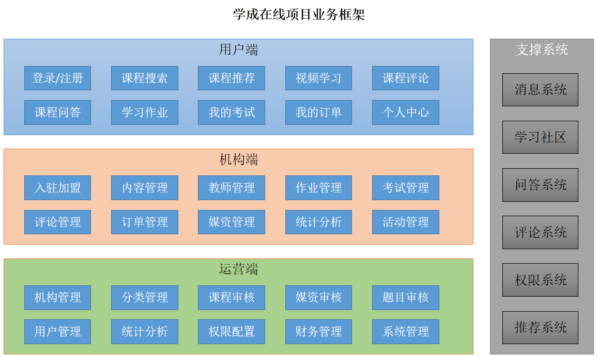
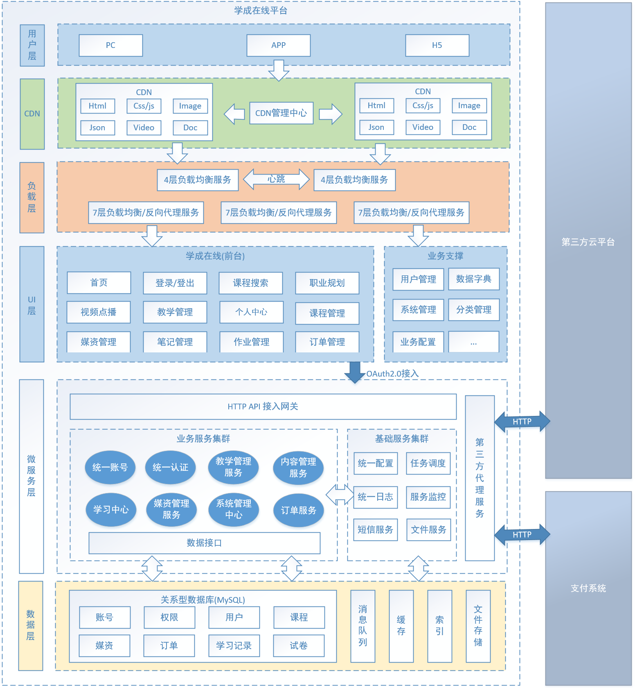
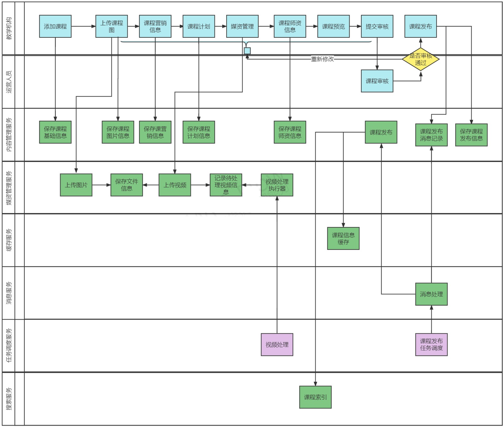
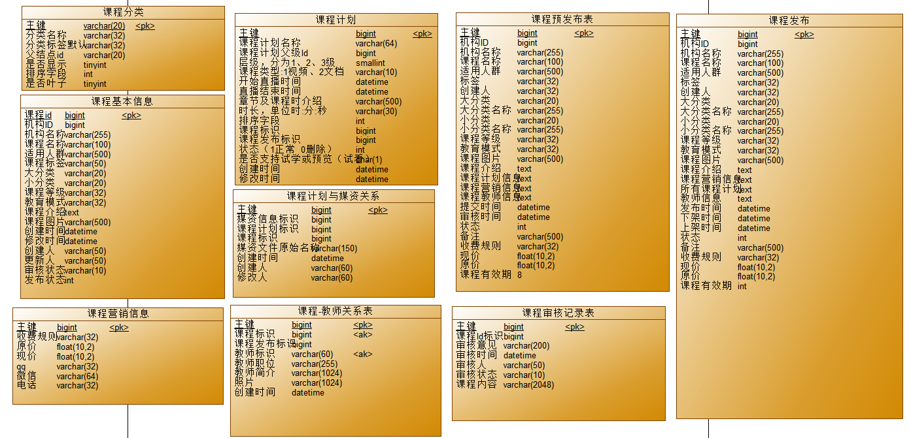

# XueCheng Plus Project

学成在线微服务项目，包含后端 Spring Cloud 微服务、前端页面、数据库脚本和本地调试脚本。

## 项目展示

### 业务功能框架



### 平台技术架构



### 课程发布流程



### 内容管理数据模型



## 项目结构

- `xuecheng-plus-parent/`：父工程与公共依赖管理。
- `xuecheng-plus-base/`：基础公共模块。
- `xuecheng-plus-auth/`：认证授权服务。
- `xuecheng-plus-gateway/`：网关服务。
- `xuecheng-plus-content/`：课程内容服务。
- `xuecheng-plus-media/`：媒资服务。
- `xuecheng-plus-learning/`：学习中心服务。
- `xuecheng-plus-orders/`：订单服务。
- `xuecheng-plus-search/`：搜索服务。
- `xuecheng-plus-system/`：系统管理服务。
- `xuecheng-plus-checkcode/`：验证码服务。
- `xuecheng-plus-message-sdk/`：消息 SDK。
- `xuecheng-plus-generator/`：代码生成相关工具。
- `frontend/`：前端项目与静态门户页面。
- `database/sql/`：数据库初始化脚本。
- `api-test/`：接口测试请求文件。
- `scripts/`：本地辅助脚本。

## 技术栈

- Java / Spring Boot / Spring Cloud
- Maven
- MySQL
- Redis
- Nacos
- Vue

## 本地运行

1. 安装并启动 MySQL、Redis、Nacos 等依赖服务。
2. 导入 `database/sql/` 下的数据库脚本。
3. 根据本地环境修改各服务 `bootstrap.yml` 或 `application.yml` 中的连接配置。
4. 在项目根目录执行 Maven 构建：

```bash
mvn clean install
```

5. 按需启动网关、认证、内容、媒资、搜索、学习、订单等服务。

## 前端

前端源码位于 `frontend/project-xczx2-portal-vue-ts/`，静态门户页面位于 `frontend/xc-ui-pc-static-portal/`。

进入前端项目后安装依赖并启动：

```bash
npm install
npm run serve
```

## 说明

仓库已忽略 `node_modules/`、`target/`、`dist/`、日志和临时文件等构建产物。
